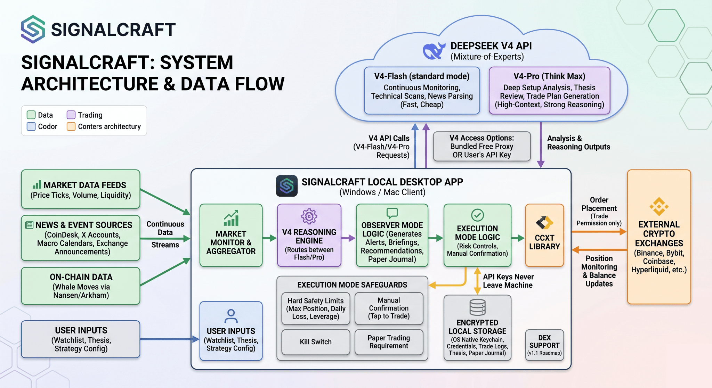

# Signalcraft — The AI Crypto Trading Assistant Powered by DeepSeek V4

**Signalcraft is a free, open-source desktop app that turns DeepSeek V4 into your personal crypto trading copilot.** Connect a watchlist, plug in your exchange API keys, and Signalcraft monitors the market 24/7 — reading price action, on-chain events, news, and whale moves in real time, then using V4's 1M-context reasoning to explain what's happening and what setups are forming. Run it as an alerts-only research assistant, or enable execution mode with hard safety limits and let it place orders on Binance, Bybit, Hyperliquid, and Coinbase with your confirmation. No subscriptions, no telemetry, no bundled fees — one-click installer for Windows and Mac, all dependencies inside, double-click and it works.
 

  

 
[Install](#install) · [How it works](#how-signalcraft-uses-deepseek-v4) · [Observer Mode](#observer-mode--the-safe-default) · [Execution Mode](#execution-mode--when-youre-ready) · [Exchanges](#supported-exchanges) · [Comparison](#comparison-with-other-ai-crypto-trading-tools) · [FAQ](#frequently-asked-questions) · [Roadmap](#roadmap)
 
---
 
## Why Signalcraft exists
 
AI crypto trading tools in 2026 fall into two categories, and both are broken. On one side: closed-source bots that charge $50–$300 a month, promise autonomous profits, use opaque strategies, and lose most users money while still collecting the fee. On the other side: open-source trading frameworks like Freqtrade or Hummingbot that are genuinely powerful but require Python, Docker, strategy coding, and weeks of setup before a single trade.
 
Signalcraft takes a different path. It treats AI crypto trading as a research and decision-support problem, not a magic money printer. The tool does what AI is actually good at — reading enormous amounts of market context in real time, reasoning through it step by step, and surfacing the signal from the noise. The human makes the call.
 
DeepSeek V4 is the engine under the hood for a specific reason. It's the first open-source model with genuine frontier-level reasoning and a 1-million-token context window that works cheaply. That combination matters for trading because a single prompt can contain a full price history, the recent news cycle, on-chain data, your thesis, and your current positions — all at once. No other current model gives you that breadth at this cost.
 
**What you get:**
 
- **100% free** — no subscription, no premium tier, no hidden fees, no in-app purchases
- **100% private** — zero telemetry, your API keys never leave your machine, no account required
- **100% native** — one-click installer for Windows and Mac, all dependencies bundled
- **100% open source** — MIT licensed, auditable source code
- **DeepSeek V4 reasoning** — 1M context, Think Max mode for high-stakes analysis, Flash for quick alerts
- **Observer mode by default** — alerts and recommendations, no automated execution until you enable it
- **Execution mode with hard safety limits** — position sizing caps, daily loss limits, kill switch, manual confirmation required per trade
- **All major crypto exchanges supported** — Binance, Bybit, Hyperliquid, Coinbase, OKX, Kraken, and more via CCXT
## Install
 
### Windows
 
Download `Signalcraft-x64.7z` from the [latest release](../../releases/latest) and double-click. The installer is digitally signed, so Windows SmartScreen passes it through without warnings. Everything needed is bundled — the V4 connector, market data clients, exchange libraries. No Python, no Docker, no terminal. Install takes about a minute.
 
### Mac
 
Download `Signalcraft.dmg` from the [latest release](../../releases/latest), open it, and drag Signalcraft to your Applications folder. Signed and notarized with an Apple Developer ID — opens without Gatekeeper warnings. Universal binary, runs natively on Apple Silicon (M1 through M5) and Intel Macs.
 
### First-time setup
 
On first launch, Signalcraft walks you through a two-minute setup:
 
1. Pick your watchlist (top-100 crypto by default, customize as needed)
2. Choose how you'll access DeepSeek V4 — bundled free-tier proxy, or paste your own DeepSeek API key for unlimited use
3. Optionally connect exchange API keys if you want execution mode later (read-only keys work fine for observer mode)
That's it. Signalcraft starts monitoring immediately.
 
## How Signalcraft uses DeepSeek V4
 
DeepSeek V4 is a Mixture-of-Experts model released in April 2026 by DeepSeek-AI. It ships in two sizes — **V4-Pro** with 1.6T total parameters (49B activated per token) and **V4-Flash** with 284B total (13B activated). Both support a one-million-token context window with hybrid attention architecture (Compressed Sparse Attention + Heavily Compressed Attention), and three reasoning effort modes: standard, Think High, and Think Max.
 
Signalcraft uses both sizes strategically:
 
- **V4-Flash (standard mode)** handles the continuous work — monitoring price feeds, parsing news streams, running technical scans on the watchlist. Fast, cheap, always-on.
- **V4-Pro (Think High / Think Max)** handles the high-stakes reasoning — analyzing a specific setup you're about to enter, reviewing whether your thesis still holds after a major event, generating the daily briefing, or reviewing a trade you're considering in execution mode.
This two-tier setup means Signalcraft can stay on 24/7 at Flash cost, and only fires up Pro reasoning when it matters. You can override the default routing in Settings if you want maximum reasoning on everything.
 
### DeepSeek V4 access options
 
**Bundled free tier (default).** Signalcraft ships with access to DeepSeek V4 through a rate-limited proxy pool. Enough for a personal watchlist of up to 30 assets with standard alert frequency. Good for evaluating the tool before committing to anything.
 
**Your own DeepSeek API key (unlimited).** Paste your DeepSeek API key in Settings and Signalcraft routes all V4 calls directly to your account. No rate limits beyond DeepSeek's own. DeepSeek API pricing is among the lowest in the industry — at current rates, a heavy user can run Signalcraft continuously for a few dollars a month.
 
In both modes, your exchange API keys and trade data stay entirely on your machine. Signalcraft operates no server, collects no telemetry, and never proxies anything other than your V4 prompts.
 
## Observer Mode — the safe default
 
Observer mode is what Signalcraft runs out of the box. No trades are executed. No exchange write-access is used. Everything is research, alerts, and recommendations — you decide what to do with them.
 
### Market monitor
 
A live feed of what's happening across your watchlist. V4-Flash reads every tick, volume change, and liquidity shift. When something crosses a threshold worth your attention, it shows up in the feed with a plain-English explanation: what happened, why it might matter, historical analogs, and what to watch next.
 
### News & event intelligence
 
Signalcraft pulls from crypto-native sources (CoinDesk, The Block, Decrypt, Bloomberg Crypto), key X accounts (customizable watchlist), on-chain events (whale moves via Etherscan, Arkham, Nansen), exchange announcements (listings, delistings, funding changes), and macro calendars (FOMC, CPI, employment data).
 
When an event hits, V4-Pro reasons through it: *"Binance just announced a listing for $TOKEN — here's the base rate for listing pumps on Binance historically, here's where the token currently trades, here's the current funding rate, here's the setup you'd want to see for a reasonable entry, here's the risk profile."*
 
### Technical setup scanner
 
V4-Flash continuously scans your watchlist for technical setups — breakouts, reversals, key level tests, divergences, volume anomalies. When it finds something worth looking at, it surfaces it with a chart annotation and an explanation. For setups you mark "interesting," V4-Pro does a deeper analysis in Think mode.
 
### Thesis tracker
 
Write down your trade thesis in plain English — *"I think SOL breaks $250 by end of month because of upcoming ETF decision + strong on-chain growth"* — and Signalcraft tracks it. New events that support or invalidate your thesis get flagged. If your thesis is invalidated by a major event (macro shift, on-chain bearish signal, key level lost), Signalcraft alerts you explicitly: *"Your SOL long thesis is now invalidated. Here's why."* This catches the single biggest retail mistake — staying in trades after the underlying reason is gone.
 
### Paper trading journal
 
Simulate trades without risking capital. Every paper trade is journaled with V4-generated analysis: why you took it, what the market looked like, how it played out, what to learn. Over time the journal becomes a structured record of your trading patterns, and V4 can identify recurring mistakes ("you tend to exit winners too early on Wednesdays") and suggest adjustments. This is how you build intuition without losing money doing it.
 
### Daily briefing
 
Every morning (time zone aware), Signalcraft generates a custom briefing: what happened overnight, what's on the watchlist that's moving, what's scheduled for today, what setups are live, what your open theses look like. Think of it as a one-page research note V4 writes for you while you were sleeping.
 
### Smart alerts
 
Standard price alerts are noise. Signalcraft alerts are conditional: *"BTC hitting $X AND volume confirming AND V4 reasoning says setup valid."* You set the conditions in plain English — *"Alert me when ETH tests the $4200 level again, but only if funding isn't extreme"* — and V4 translates that into the actual monitoring logic.
 
## Execution Mode — when you're ready
 
Execution mode is **opt-in** and off by default. You have to explicitly enable it in Settings, confirm you understand the risks, and complete a short setup process before any trade goes live.
 
When enabled, Signalcraft can place orders on your connected exchanges based on your saved strategies. But "auto-trading" here doesn't mean "AI does whatever it wants with your money." It means fewer clicks between a signal and an order — with strict guardrails in between.
 
### Hard safety limits
 
Every execution-mode user sets these before trading goes live, and they're hard-coded into the order flow:
 
- **Max position size** as a percentage of portfolio — typical starting value 1–3%
- **Max daily loss** — trading pauses automatically if hit, until next UTC day
- **Max concurrent positions** — caps simultaneous exposure
- **Max leverage** — default 1x (spot only); derivatives require explicit opt-in with additional disclaimers
- **Instrument whitelist** — only assets you've pre-approved can be traded
- **Cool-down period** after losses — prevents revenge trading
These limits cannot be bypassed by the AI. If V4 wants to enter a trade that would violate any of them, the trade is rejected and shown to you as a blocked recommendation, not an executed order.
 
### Manual confirmation
 
By default, every trade requires a one-tap confirmation. Signalcraft shows you the setup, V4's reasoning, the risk profile, and the exact order — you tap Confirm or Skip. If you want to turn confirmation off for specific strategies, that's a separate opt-in with its own disclaimer.
 
### Kill switch
 
Big red button in the main UI. One tap closes all open positions at market and disables execution mode until you manually re-enable it. Use it anytime you feel off.
 
### Paper trading requirement
 
Execution mode requires 30 days of continuous paper trading before live funds can be activated, with a minimum number of paper trades executed. This isn't to be annoying — it's to make sure you understand how Signalcraft behaves before it touches real money.
 
### What gets automated and what doesn't
 
- **Automated:** order placement, stop-loss placement, take-profit placement, position monitoring, trailing stops, risk-limit enforcement
- **Not automated (always manual):** portfolio rebalancing, strategy selection, watchlist changes, safety limit adjustments, API key management
## Supported Exchanges
 
Signalcraft uses CCXT under the hood, which means it supports a long list of crypto exchanges out of the box.
 
**Spot trading:** Binance, Coinbase, Kraken, OKX, Bybit, Bitfinex, KuCoin, Gate.io, Bitstamp, Gemini, Crypto.com Exchange, MEXC, and 80+ more.
 
**Derivatives / perpetuals:** Binance Futures, Bybit, OKX, Hyperliquid, dYdX, Kraken Futures, Bitget. Derivatives require explicit opt-in with leverage disclaimers before trading is enabled.
 
**DEX support** *(v1.1)*: Jupiter (Solana), Uniswap (Ethereum/Base), GMX (Arbitrum).
 
Your API keys live in encrypted local storage using OS-native keychains (Windows Credential Manager, macOS Keychain). They never leave your machine.
 
## Comparison with other AI crypto trading tools
 
| Feature | Signalcraft | 3Commas | Cryptohopper | Freqtrade | Hummingbot | MoneyFlare |
|---|---|---|---|---|---|---|
| Price | **Free** | $29–$99/mo | $24–$128/mo | Free | Free | Paid tiers |
| Open source | **Yes** | No | No | Yes | Yes | No |
| One-click install | **Yes** | N/A (web) | N/A (web) | No (Docker/Python) | No (Docker/Python) | N/A (web) |
| LLM-powered reasoning | **Yes (V4)** | No | Partial (rules-based AI) | No | No | Opaque |
| 1M context per analysis | **Yes** | No | No | No | No | No |
| Observer-only mode | **Yes** | Partial | No | No | No | No |
| Thesis tracking | **Yes** | No | No | No | No | No |
| Paper trading journal with AI | **Yes** | Basic | Basic | Manual | Manual | No |
| News & event intelligence | **Yes** | No | Partial | No | No | Partial |
| On-chain data integration | **Yes** | No | No | Manual | Manual | No |
| Hard safety limits per-user | **Yes** | Partial | Partial | Manual config | Manual config | Opaque |
| Kill switch | **Yes** | Partial | No | Manual | Manual | No |
| Your API keys stay local | **Yes** | No (cloud) | No (cloud) | Yes | Yes | No (cloud) |
| Source code auditable | **Yes** | No | No | Yes | Yes | No |
| Zero telemetry | **Yes** | No | No | Yes | Yes | Unknown |
 
## Safety & privacy
 
- **API keys never leave your machine.** Signalcraft uses OS-native keychains (Windows Credential Manager, macOS Keychain) for all exchange credentials. No cloud sync, no server, no backup anywhere.
- **Trade-only permissions recommended.** For execution mode, use exchange API keys with trade permissions only, not withdrawal. Even if Signalcraft or your machine were compromised, funds can't be moved off-exchange.
- **IP allowlists where supported.** Binance, Coinbase, OKX and others let you restrict API keys to specific IPs. We strongly recommend using this feature.
- **No telemetry.** Signalcraft makes no analytics calls at launch or during trading. Network traffic is limited to: your V4 API calls, market data feeds, exchange APIs, news sources you enabled. All verifiable with a firewall.
- **Open source.** Every line of code is in this repository. Build from source and verify the binary if you're security-conscious.
- **Encrypted local state.** Your thesis, paper trades, alert settings, and strategy configurations are stored encrypted on disk with OS-level protection.
## Frequently Asked Questions
 
### Is Signalcraft a free AI crypto trading bot?
 
Yes. 100% free, MIT licensed, no premium tier, no in-app purchases. The app itself costs nothing. The only money you might spend is on DeepSeek API calls if you use your own API key for unlimited access — typically a few dollars a month for active users.
 
### Is this just another crypto trading bot?
 
No. Signalcraft is explicitly not a "set it and forget it" auto-trading bot. It's a research and decision-support tool. Observer mode by default means no trades happen until you explicitly opt in. Execution mode has hard safety limits and per-trade confirmation as the default. The philosophy is: AI is great at reading market context, humans are in charge of the decisions.
 
### How does DeepSeek V4 help with crypto trading?
 
DeepSeek V4 is the first open-source model with frontier-level reasoning and a 1M-token context window at low cost. For crypto trading specifically, that combination means one prompt can contain the full price history of an asset, the recent news cycle, current on-chain data, your open positions, and your trade thesis — all analyzed together. Older models either couldn't fit that much context or couldn't reason well across it. V4 does both.
 
### Does Signalcraft guarantee profits?
 
No. Nothing in crypto trading guarantees profits, including AI-powered tools. The majority of retail traders lose money, and no amount of reasoning from any model changes that baseline. Signalcraft can help you be more systematic, catch things you'd otherwise miss, and avoid specific categorical mistakes (trading against your own thesis, skipping stops, revenge trading after losses). It can't predict the market.
 
### What crypto exchanges does Signalcraft support?
 
Via CCXT, Signalcraft supports 90+ crypto exchanges for spot trading, including Binance, Coinbase, Kraken, OKX, Bybit, Bitfinex, KuCoin, and many more. For derivatives, it supports Binance Futures, Bybit, OKX, Hyperliquid, dYdX, Kraken Futures, and Bitget. DEX support is on the v1.1 roadmap.
 
### Do I have to give Signalcraft control of my funds?
 
Only if you enable execution mode. In observer mode (the default), read-only API keys are sufficient — Signalcraft reads your balance and positions but cannot place any orders. Execution mode requires API keys with trade permissions, and we recommend not granting withdrawal permissions on any key connected to any trading tool, Signalcraft included.
 
### Is it safe to connect my exchange API keys to a trading tool?
 
Signalcraft stores API keys in OS-native encrypted keychains (Windows Credential Manager, macOS Keychain) — the same mechanism Chrome, Slack, and 1Password use for credentials. Keys never leave your machine, are never synced anywhere, and are never sent to any server. If you're security-conscious, use trade-only permissions (not withdrawal) and enable exchange-side IP allowlists.
 
### Do I need a DeepSeek API key?
 
No, you can start immediately using Signalcraft's bundled free-tier access, which routes through a rate-limited proxy pool. This is enough for a watchlist of up to 30 assets with standard alert frequency. If you hit the limits or want more intensive reasoning, paste your own DeepSeek API key in Settings and Signalcraft routes directly to your account.
 
### What's the difference between V4-Pro and V4-Flash in Signalcraft?
 
V4-Flash (284B parameters, 13B activated) handles continuous background work — price monitoring, news parsing, basic setup scanning. It's fast and cheap. V4-Pro (1.6T parameters, 49B activated) handles high-stakes reasoning — deep setup analysis, thesis review after major events, daily briefings, pre-trade analysis in execution mode. Signalcraft routes between them automatically based on task complexity. You can override the routing in Settings.
 
### What's Think Max mode and when does Signalcraft use it?
 
DeepSeek V4 supports three reasoning effort modes: standard, Think High, and Think Max. Think Max significantly increases reasoning time (and token use) for the highest-stakes analysis. Signalcraft uses it sparingly — only when you explicitly request a "deep analysis" on a setup, when reviewing a trade you're about to execute in execution mode, or when generating the daily briefing. This keeps costs down while making sure the most important decisions get the strongest reasoning available.
 
### Can I run DeepSeek V4 locally on my own machine?
 
V4-Pro is a 1.6T-parameter model. Running it locally requires data-center-grade hardware — multiple H100 or B200 GPUs, hundreds of GB of VRAM. This is beyond consumer hardware. V4-Flash at 284B is more accessible but still requires multiple high-end GPUs. For practical retail use, API access (either bundled free tier or your own key) is the only realistic option.
 
### Can Signalcraft help me if I'm new to crypto trading?
 
Yes, but carefully. For beginners, we strongly recommend: start in observer mode only, use the paper trading journal for at least 60 days before considering execution mode, keep position sizes small, and treat Signalcraft as one input among many, not an authority. Crypto is volatile and new traders lose money at high rates — AI tools are a productivity multiplier, not a safety net.
 
### Is crypto trading legal where I live?
 
Crypto trading is legal in most jurisdictions but regulated differently in each. Some countries ban crypto entirely, some restrict specific activities (derivatives, staking, specific tokens), some require registration with tax authorities. You're responsible for knowing the rules in your jurisdiction and complying with them. Signalcraft is a tool — what you do with it is your responsibility.
 
### How does Signalcraft compare to 3Commas or Cryptohopper?
 
3Commas and Cryptohopper are cloud-hosted trading automation platforms with subscription pricing ($24–$128 per month) and closed-source code. They focus on rule-based automation with some light AI features. Signalcraft is free, open source, runs locally (your keys never leave your machine), and uses frontier-level LLM reasoning (DeepSeek V4) rather than simple rules-based signals. Different tools for different needs.
 
### How does Signalcraft compare to Freqtrade or Hummingbot?
 
Freqtrade and Hummingbot are powerful open-source trading frameworks but require significant technical skill — Python, Docker, strategy coding, backtesting setup. They're aimed at technical traders building their own algo strategies. Signalcraft is aimed at retail traders who want AI-assisted research and decision support with a one-click installer and no coding. Different audiences.
 
### Why open source? What's the catch?
 
No catch. Open source means the code is auditable, which matters a lot when a tool has access to your exchange API keys. You can verify for yourself that nothing shady is happening. Signalcraft is built by developers who wanted a tool like this for their own trading and released it publicly rather than gate-keeping. If you want to support development, there's a GitHub Sponsors link, but nothing is paywalled.
 
## Roadmap
 
**v1.1** — DEX support (Jupiter on Solana, Uniswap on Ethereum/Base, GMX on Arbitrum). Strategy marketplace (community-contributed alert and signal recipes, all open source). Backtesting engine for strategies against historical data. Mobile companion app (view positions, receive push notifications — no trade execution).
 
**v1.2** — Advanced portfolio analytics (drawdown analysis, return attribution, correlation matrices). Multi-account support (separate execution contexts for different strategies). Copy-from-yourself (mirror your discretionary trades into an automated rule set).
 
**v2.0** — Social features (optional sharing of anonymized strategy performance, leaderboards for paper trading). Plugin architecture for custom data sources and broker integrations. Voice briefings and voice alerts.
 
See [open issues](../../issues) and [discussions](../../discussions) to vote or propose.
 
## License
 
MIT License. See [LICENSE](LICENSE).
 
## Disclaimer
 
Signalcraft is a research and decision-support tool for cryptocurrency trading. It is not an investment advisor, broker-dealer, or licensed financial services provider. Nothing produced by Signalcraft constitutes financial advice, investment advice, trading advice, or any other sort of advice, and you should not treat any of its output as such.
 
Cryptocurrency trading involves substantial risk of loss. The majority of retail cryptocurrency traders lose money. Using AI-powered analysis does not change this baseline — it may help you be more systematic and catch specific mistakes, but it cannot predict markets or guarantee profits. Past performance of any strategy, including those recommended or analyzed by Signalcraft, does not indicate future results.
 
You are solely responsible for your trading decisions, for the consequences of those decisions, for securing your exchange API keys, for complying with the laws and regulations of your jurisdiction, and for understanding the risks of every trade you place. The authors and contributors of Signalcraft accept no liability for any losses, damages, or adverse outcomes resulting from use of this software.
 
Do your own research. Never trade with money you cannot afford to lose. When in doubt, don't trade.
 
---
 
**If Signalcraft made you a better trader or saved you from a bad trade, please star ⭐ the repo on GitHub.** It's the only metric we track.
